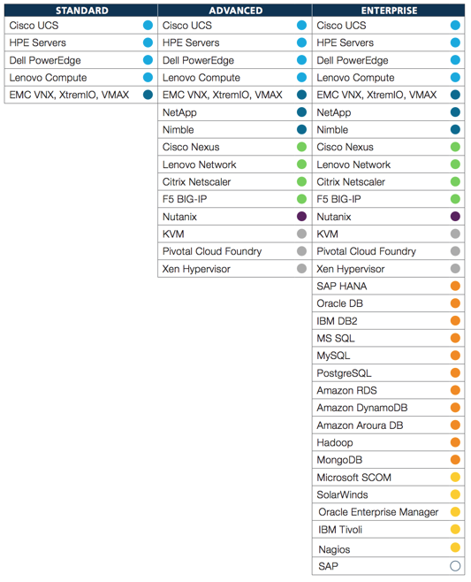
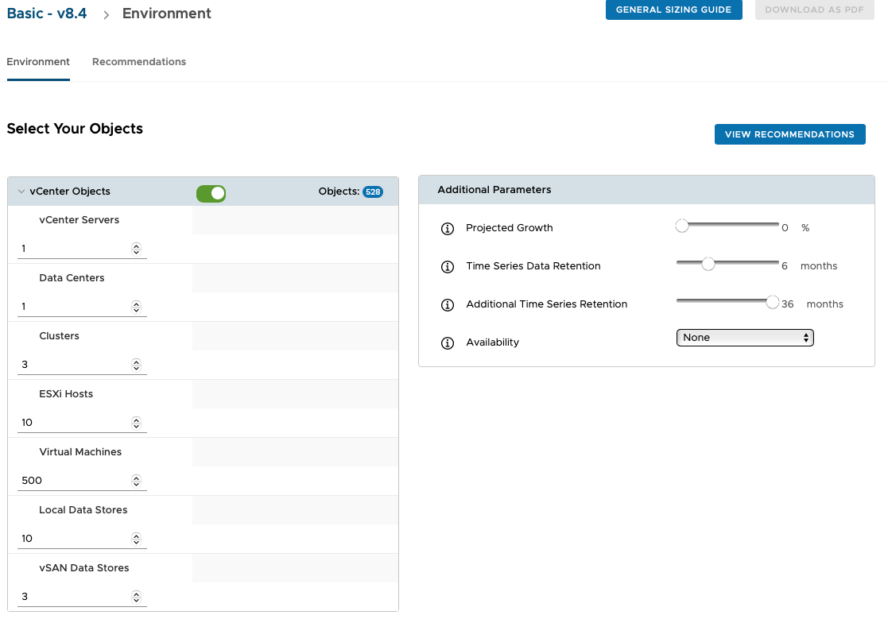
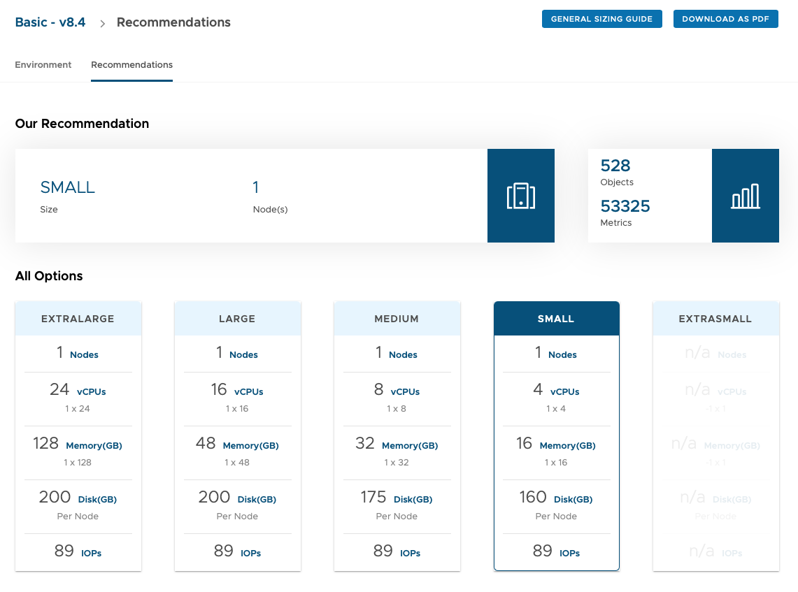
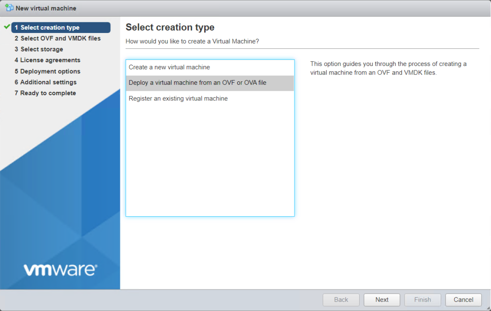
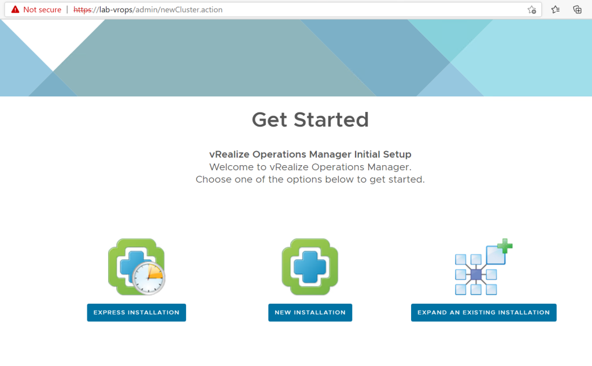
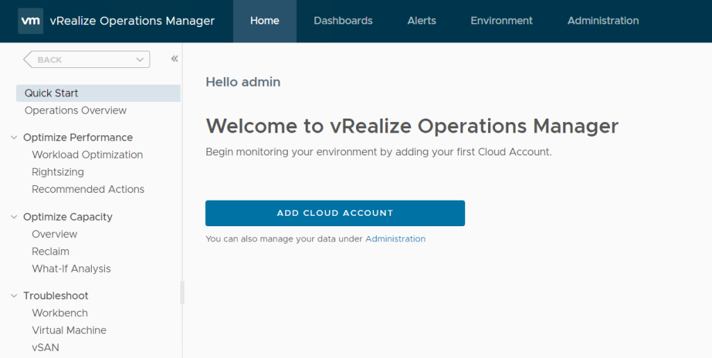

import SpotifyPlayer from "./SpotifyPlayer";


vROps 是 VMware 发布的一款应用，可以用来针对 vSphere 环境中的 vCenter、ESXi 等组件进行监控、优化和管理。

vROps 有三个不同的版本:

- **Standard** 只能管理 vSphere；
- **Advanced** 多了 VMware cloud、操作系统监控和 dashboards；
- **Enterprise** 功能最全的，可以监控应用、数据库以及第三方的包；



本实验环境，选择 **Enterprise** 版本。

vROps 可以用来对虚拟机之上或之下的监控、容量规划和趋势分析。

此文中选择 virtual appliance 来部署 vROps。实施之前，第一步应该确认需安装哪种容量的 appliance。[VMware 官方提供了一个容量大小计算工具](https://kb.vmware.com/s/article/2093783)来帮助我们正确的选择 appliance 的大小，或则使用同样是 VMware 官方提供的 [vRealize Operations Manager Sizing 工具](https://vropssizer.vmware.com/sizing-wizard/choose-installation)。

首先选择 vROps 版本，然后添加 vCenter、ESXi 主机、datastores、虚拟机的数量：



会自动计算出一个相对合理的 vROps 大小：



在部署任何 VMware appliance 之前，都建议创建好静态的 DNS 解析记录，这样在部署好 appliance 之后可以更方便的连接上去，并且可以减少出错的几率，因为 VMware 很多组件都强依赖于 DNS。

部署 DNS 可以参考博客的另一篇文章 [Linux 系统安装 DNS 服务](www.baidu.com)。

在 vCenter 上新建虚拟机，选择从 OVF 或 OVA 文件部署虚拟机：
cr



依次执行 「选择 OVF 文件」 「选择 datastore」 、「同意协议」、「选择部署的网络」、「选择时区」、「IP 地址和子网、路由」、「完成」。

虚拟机安装完成后，通过 Web 连接到 vROps。



选择 「express installation」，因为本环境中只有 1 个vCenter。然后选择 「密码」、「完成安装」。

vROps 安装完成后，再次通过 Web 连接到 vROps，继续配置「用户协议」、「license」、「用户体验改进计划」，最后完成配置。



接下来将 vCenter 添加到 vROps。


```php:title=include/defines.inc.php {4-5,}
vi /usr/share/zabbix/include/defines.inc.php

...
define(‘ZBX_GRAPH_FONT_NAME’,           ‘msyh’); // font file name
define(‘ZBX_FONT_NAME’, ‘msyh’);
...
```
