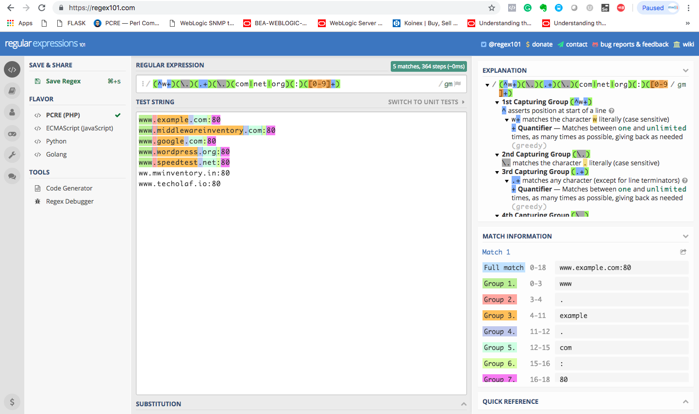
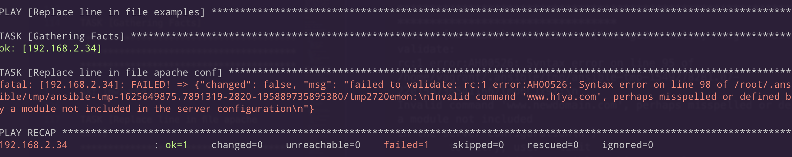
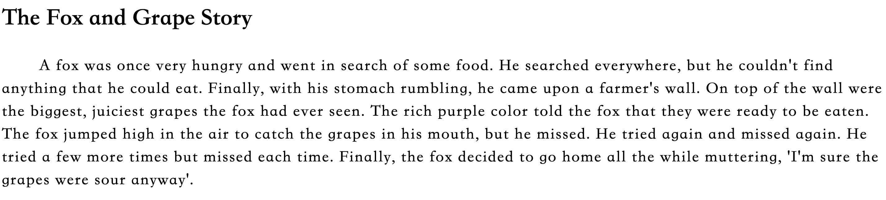
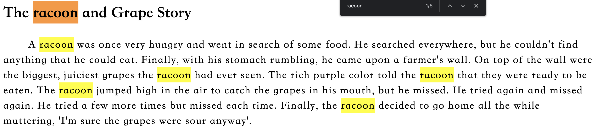
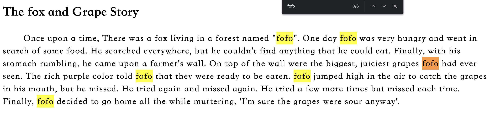
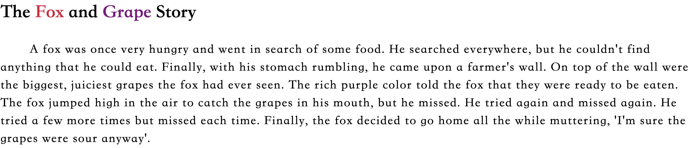
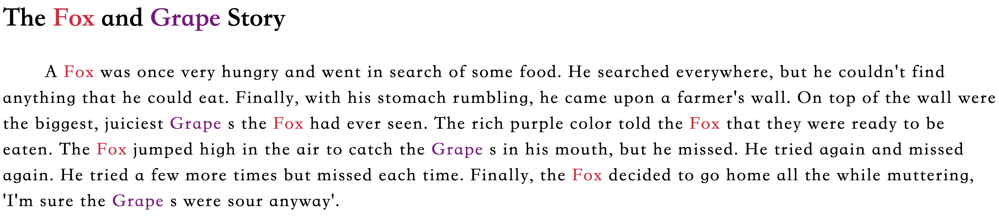
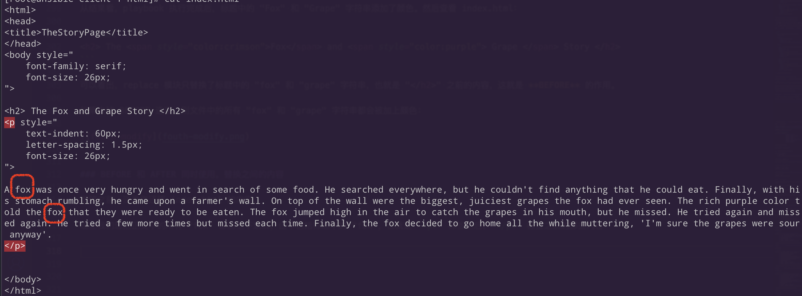
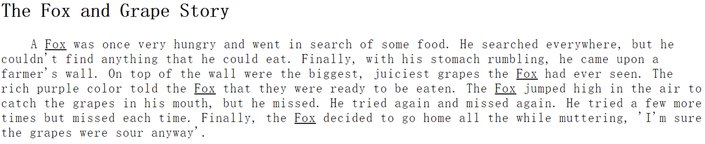

import SpotifyPlayer from "./SpotifyPlayer";

本篇文章是关于「如何使用 Ansible 替换文件中的内容，及其 [replace](https://docs.ansible.com/ansible/latest/collections/ansible/builtin/replace_module.html) 模块的一些使用示例」。使用 **replace** 模块来替换文件内容，和我们平常使用编辑器时的 <kbd>Ctrl</kbd>+<kbd>F</kbd> **查找/替换**功能类似，**replace** 模块还支持正则表达式。

除了 **replace** 模块，Ansible 还可以用 [lineinfile](https://www.middlewareinventory.com/blog/ansible-lineinfile-examples/) 模块来执行替换的功能，它们有一个不同之处就是，**replace** 会替换掉所有匹配的实例，是全局的，而 **lineinfile** 只会替换最后或最开始一个匹配到的实例，是局部的。


## 一、**replace** 简介

- 用来替换文件中所有被匹配到的字符串；
- 类似于「查找全部、替换全部」；
- 替换之前可以用 **backup** 参数备份源文件；
- 支持正则表达式；
- 支持替换匹配到的字符串的前一行或后一行的内容；
- 支持替换两个匹配到的字符串/行之间的内容，或则同时使用**前一行/后一行**的功能；
- 文件不可用时，替换任务会失败；
- 支持验证所做的更改；

## 二、使用 **replace** 模块

### 2.1 正则表达式简介

来自维基的解释：

> 正则表达式 **regex** 或 **regexp**（有时称为有理表达式）是定义搜索模式的字符序列。通常这种模式被字符串搜索算法用于对字符串执行 "find" 或 "find and replace" 操作，或者用于输入验证。它是在理论计算机科学和形式语言理论中发展起来的一种技术。

日常操作中，当我们想用程序化的方式来搜索时，90% 的概率会使用到正则表达式。一个正确的正则表达式可以帮助我们更准确的查找需要的字符串、行。正则表达式也是 Ansible 的 replace 模块中一个重要的工具，Ansible 中的正则表达式来自于 [Python 的 正则表达式](https://docs.python.org/zh-cn/3/library/re.html)。但有时某些复杂的正则表达式对于即使经常使用它的人来说也不一定可以一次写对，需要重复的修改、检查，推荐一个[ 网站 ]((https://regex101.com/))来帮助我们校对那些复杂的正则表达式。

### 2.2 测试正则表达式


[REGEX 101](https://regex101.com/) 是一个用来编写和测试正则表达式的免费网站。下面的截图展示了这个网站的功能：




### 2.3 使用 **replace** 替换单个字符串

这是一个最简单的 playbook，后文会在此基础上不断增加新的功能。这个 playbook 的作用是将 Apache Virtual host 中老的 domain name 更改为新的 domain name。

```yaml
---
  - name: Replace line in file examples
    hosts: web
    tasks:
    - name: "Replace line in file examples"
      become: yes
      become_user: root
      replace: 
        path: /etc/httpd/conf/httpd.conf
        regexp: '(^ServerName\s)(.*)$'
        replace: '\1www.h1ya.com'
        backup: yes
```

#### playbook 解释

- path - 被操作的文件；
- regexp - 搜索字符串时使用的正则表达式，在本例中：

  - () – 对正则表达式进行分组并创建反向引用，这样可以在替换时执行反向引用；
  - ^ – 匹配行的开头；
  - ServerName – 匹配文本字符串；
  - \s – 匹配空格；
  - .* – 匹配一个或多个字符/数字（不包括新行）；
  - $ – 匹配行尾；
- replace - 被替换成此字符串，本例中：
  - \1 - 反向引用，代表匹配的第一组，即 `（^ServerName\s）` 的结果；
  - backup - 更改之前先备份文件；

### 2.4 提交更改前先验证

**replace** 模块还有一个很有用的功能，就是在对文件提交更改前，可以先验证所做的更改是否正确。

> Ansible 不会直接处理目标文件，它会将文件克隆保存在 `ansible_temp` 目录中，一旦更改完成，它将复制更改后的克隆文件去替换原始文件。

正因如此，Ansible 才可以在提交更改前先验证文件内容的正确性。比如：

```yaml
---
  - name: Replace line in file examples
    hosts: web
    tasks:
    - name: "Replace line in file apache conf"
      become: yes
      become_user: root
      replace: 
        path: /etc/httpd/conf/httpd.conf
        regexp: '(^ServerName\s)(.*)$'
        replace: '\1www.h1ya.com'
        backup: yes 
        validate: apachectl -f %s -t
```

> 其中 `%s` 代表目标文件的临时文件或副本。

如果验证的文件内容有错误，比如把 playbook 中的 `replace: '\1www.h1ya.com'` 改为 `replace: 'www.h1ya.com'`，在经过 replace 后，httpd.conf 配置文件中的 **ServerName** 字符串会被删掉，此时 `validate` 命令的返回结果为非 **0**，playbook 执行失败并会抛出一个错误：




### 2.5 使用 **replace** 替换多个字符串

首先构造一段 HTML 文本，内容是经典的「吃不到葡萄说葡萄酸的故事」，保存为 `/var/www/html/index.html`。

```html:title=/var/www/html/index noLineNumbers
<html>
<head>
<title>TheStoryPage</title>
</head>
<body style="
    font-family: serif;
    font-size: 26px;
">

<h2> The Fox and Grape Story </h2>
<p style="
    text-indent: 60px;
    letter-spacing: 1.5px;
    font-size: 26px;
">

A fox was once very hungry and went in search of some food. He searched everywhere, but he couldn't find anything that he could eat. Finally, with his stomach rumbling, he came upon a farmer's wall. On top of the wall were the biggest, juiciest grapes the fox had ever seen. The rich purple color told the fox that they were ready to be eaten. The fox jumped high in the air to catch the grapes in his mouth, but he missed. He tried again and missed again. He tried a few more times but missed each time. Finally, the fox decided to go home all the while muttering, 'I'm sure the grapes were sour anyway'.
</p>


</body>
</html>
```

通过浏览器访问：



#### 替换掉所有匹配的实例

将上面 HTML 文件中的 "fox" 替换为 "raccoon"。playbook 如下：


```yaml
---
  - name: Replace line in file examples
    hosts: web

    handlers:
      - name: restart apache
        become: yes
        become_user: root
        service: name=httpd state=restarted

    tasks:
    - name: "Replace line in file examples"
      become: yes
      become_user: root
      replace: 
        path: /var/www/html/index.html
        regexp: '[F|f]ox'
        replace: 'racoon'
        backup: yes 
      notify: restart apache
```

> playbook 中使用了一个 [Handlers](https://docs.ansible.com/ansible/latest/user_guide/playbooks_handlers.html)，当 replace 任务完成时，会重启 apache。可以把 **Handlers** 理解为一个函数，然后 **notify** 是一个函数调用。

在正则表达式中，`[F|f]ox` 将会同时匹配到 **Fox** 和 **fox**，playbook 执行完成后，可以在浏览器中查看替换的结果。



进行下一步之前，先用备份的文件把内容还原（在 /var/www/html/ 目录中会自动生成备份文件 index.html.xxxx.xxxx...）。

#### 使用 AFTER 参数替换满足表达式行到文件末尾之间的内容

playbook 如下：

```yaml
---
  - name: Replace line in file examples
    hosts: web

    handlers:
      - name: restart apache
        become: yes
        become_user: root
        service: name=httpd state=restarted

    tasks:

    - name: "Replacing all fox with fofo - Leaving the title untouched"
      become: yes
      become_user: root
      replace: 
        path: /var/www/html/index.html
        regexp: 'fox'
        replace: 'fofo'
        after: "The fox and Grape Story"
        backup: yes 
    
    - name: "Naming our Hero and introduction line"
      become: yes
      become_user: root
      replace: 
        path: /var/www/html/index.html
        regexp: 'A fofo was once'
        replace: 'Once upon a time, There was a fox living in a forest named "fofo". One day fofo was'
        backup: yes    
    
    - name: "Grammatical correction - The fofo to fofo"
      become: yes
      become_user: root
      replace: 
        path: /var/www/html/index.html
        regexp: '[T|t]he fofo'
        replace: 'fofo'
        backup: yes    
      notify: restart apache
```



从结果来看，playbook 完成了两件事情：

- 在故事的开头添加了一句 "Once upon a time, There was a fox..."；
- 将所有的 **fox** 替换为了 **fofo**，但是除了标题中的 "fox"，因为使用了 **after** 选项；

在继续后面的例子之前，还是将 index.html 文件还原。

### 使用 BEFORE 参数替换满足表达式行到文件开头之间的内容


```yaml
---
  - name: Replace line in file examples
    hosts: web

    handlers:
      - name: restart apache
        become: yes
        become_user: root
        service: name=httpd state=restarted

    tasks:

    - name: "Replacing the Fox with Formatting only in headline before closing of H2"
      become: yes
      become_user: root
      replace: 
        path: /var/www/html/index.html
        regexp: '[F|f]ox'
        replace: '<span style="color:crimson">Fox</span>'
        before: "</h2>"
        backup: yes

    - name: "Replacing the Grape with Formatting only in headline before closing of H2"
      become: yes
      become_user: root
      replace: 
        path: /var/www/html/index.html
        regexp: '[G|g]rape'
        replace: '<span style="color:purple"> Grape </span>'
        before: "</h2>"
        backup: yes   
      notify: restart apache
```

执行完成后，还是先看效果：




从结果看，playbook 执行完成后，标题中的 "Fox" 和 "Grape" 字符串添加了颜色，正文中的 "fox" 和 "grape" 不受影响。然后查看 index.html：

```html
<h2> The <span style="color:crimson">Fox</span> and <span style="color:purple"> Grape </span> Story </h2>
```

可以看出，replace 模块只替换了标题中的 "fox" 和 "grape" 字符串，也就是 `</h2>` 之前的内容，这就是 **BEFORE** 的作用。

如果去掉 BEFORE 选项，则文件中的所有 "fox" 和 "grape" 字符串都会被加上颜色：




### BEFORE 和 AFTER 同时使用，替换之间的内容

继续之前，还是先还原 index.html 的内容。

现在我们想把正文中的所有 "fox" 都加上下划线，但不包括标题中的 "fox"，也就是 `<p>` 标签之后、`</p>` 标签之前的那些内容：



playbook 如下：

```yaml noLineNumbers
---
  - name: Replace line in file examples
    hosts: web

    handlers:
      - name: restart apache
        become: yes
        become_user: root
        service: name=httpd state=restarted

    tasks:
    - name: "Replacing the Fox in the Story with Underline formatting"
      become: yes
      become_user: root
      replace: 
        path: /var/www/html/index.html
        regexp: '[F|f]ox'
        replace: '<u>Fox</u>'
        # Matches the Start of P tag
        after: '<p\s[.|\w|=|\"|\r|\n|\s|\-|:|;]*>'
        # Matches the End of P tag
        before: '</p>'
        backup: yes  
      notify: restart apache
```

执行完 playbook 后，浏览器访问效果如下：


