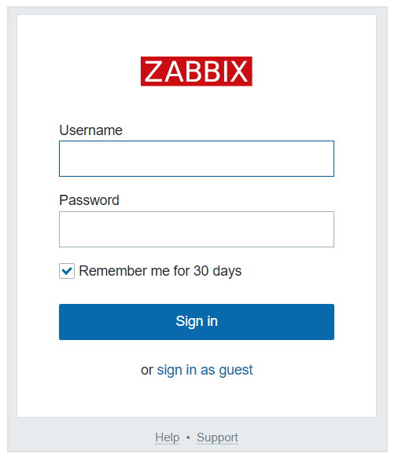

import SpotifyPlayer from "./SpotifyPlayer";

## 部署 Zabbix 5.4 容器版

> 本文的部署方案基于 **CentOS Stream 8** 版本。

### 1. 安装 Docker

Docker 的安装比较简单，按照 [官方文档](https://docs.docker.com/engine/install/centos/)中的步骤安装即可，安装方法选用的 [Yum](https://docs.docker.com/engine/install/centos/#install-using-the-repository)。

首先先卸载旧版本的 Docker：

```shell noLineNumbers
yum remove docker \
                  docker-client \
                  docker-client-latest \
                  docker-common \
                  docker-latest \
                  docker-latest-logrotate \
                  docker-logrotate \
                  docker-engine
```

安装 yum-utils 包：
```
yum install -y yum-utils
```

添加 Docker 的 yum 仓库地址：
```
yum-config-manager \
    --add-repo \
    https://download.docker.com/linux/centos/docker-ce.repo
```

安装 Docker 最新版本：
```
yum install docker-ce docker-ce-cli containerd.io
```

启动并激活 Docker 服务：
```
systemctl start docker
systemctl enable docker
```

安装完成后，新建一个普通用户 (**non-root**) 来运行 Docker 容器：
```
useradd zbxer
usermod -aG docker zbxer
```

### 2. 安装 Zabbix

Docker 安装好后，接着按照[ Zabbix 的官方文档]((https://www.zabbix.com/documentation/current/manual/installation/containers))安装 Zabbix 容器版。

由于 Zabbix Server 需要运行多个服务，所以按照所需的功能不同，也需要安装多个不同的容器，本例中一共会创建 5 个容器：

- MySQL 数据库容器
- Zabbix snmptraps 服务容器
- Zabbix Server 容器
- Zabbix Web 容器
- Zabbix Agent 容器

其他容器，比如 Java Gateway 等，可以参考 Zabbix 在 Docker Hub 上的 [官方镜像仓库](https://hub.docker.com/u/zabbix/)。


##### 2.1 创建 Zabbix 组件容器的专用网络

创建网络：

```docker
docker network create --subnet 172.20.0.0/16 --ip-range 172.20.240.0/20 zabbix-net
```

##### 2.2 启动一个空的 MySQL 实例容器

创建容器：

```docker
docker run --name mysql-server -t \
      -e MYSQL_DATABASE="zabbix" \
      -e MYSQL_USER="zabbix" \
      -e MYSQL_PASSWORD="zbx_p@ssw0rd" \
      -e MYSQL_ROOT_PASSWORD="zbx_p@ssw0rd" \
      --network=zabbix-net \
      -d mysql:latest \
      --character-set-server=utf8 --collation-server=utf8_bin \
      --default-authentication-plugin=mysql_native_password
```

##### 2.3 启动一个 Zabbix snmptraps 容器

创建容器：

```docker
docker run --name zabbix-snmptraps -t \
      -v /zbx_instance/snmptraps:/var/lib/zabbix/snmptraps:rw \
      -v /var/lib/zabbix/mibs:/usr/share/snmp/mibs:ro \
      --network=zabbix-net \
      -p 162:1162/udp \
      --restart unless-stopped \
      -d zabbix/zabbix-snmptraps:latest
```
> Zabbix snmptraps 容器暴露 UDP 162 端口。

##### 2.4 启动一个 MySQL 版的 Zabbix Server 容器，并链接到之前的 MySQL 容器

创建容器：

```docker
docker run --name zabbix-server-mysql -t \
      -e DB_SERVER_HOST="mysql-server" \
      -e MYSQL_DATABASE="zabbix" \
      -e MYSQL_USER="zabbix" \
      -e MYSQL_PASSWORD="zbx_p@ssw0rd" \
      -e MYSQL_ROOT_PASSWORD="zbx_p@ssw0rd" \
      -e ZBX_STARTVMWARECOLLECTORS="5" \
      --network=zabbix-net \
      -p 10051:10051 \
      --restart unless-stopped \
      -d zabbix/zabbix-server-mysql:latest
```
> Zabbix Server 容器暴露 TCP 10051 端口。

##### 2.5 开启 Zabbix Web 容器，并链接到之前的 MySQL 容器和 Zabbix Server 容器

创建容器：

```docker noLineNumbers
docker run --name zabbix-web-nginx-mysql -t \
      -e ZBX_SERVER_HOST="zabbix-server-mysql" \
      -e DB_SERVER_HOST="mysql-server" \
      -e MYSQL_DATABASE="zabbix" \
      -e MYSQL_USER="zabbix" \
      -e MYSQL_PASSWORD="zbx_p@ssw0rd" \
      -e MYSQL_ROOT_PASSWORD="zbx_p@ssw0rd" \
      --network=zabbix-net \
      -p 80:8080 \
      --restart unless-stopped \
      -d zabbix/zabbix-web-nginx-mysql:latest
```
> Zabbix Web 容器暴露 TCP 80 端口。

##### 2.6 为 Zabbix Server 启动 Agent 容器

创建容器：

```docker
docker run --name zabbix-agent \
      --link mysql-server:mysql \
      --link zabbix-server-mysql:zabbix-server \
      --network=zabbix-net \
      -e ZBX_HOSTNAME="ZABBIX-SERVER" \
      -e ZBX_SERVER_HOST="zabbix-server-mysql" \
      -d zabbix/zabbix-agent
```

这里可能会遇到一个错误：

```
docker: Error response from daemon: Cannot link to container-name, as it does not belong to the default network.
```

这个错误通常发生在使用 docker-compose 的时候，因为 docker-compose 会根据项目名字自动创建一个新的网络：**project-name_default**，可使用 `docker network ls` 命令查看，所以链接容器的时候需要加上对应的 Docker 网络，比如：

```
docker run --link my_app_mq_1:mq --link my_app_db_1:db -it --net myapp_default worker
```

[参考这里](https://stackoverflow.com/a/36489937) 获取更详细的说明。

到此为止，Zabbix Server 所需的 5 个容器都已经安装完成了，访问 http://zabbix-server-ip 应该可以打开 Zabbix Server 的管理界面，默认的用户名和密码是**Admin/zabbix**。




##### 2.7 启动一个 grafana 容器，并安装 Zabbix 插件

Zabbix 虽然在搜集指标数据方面非常优秀，但其数据展现能力一般，不能很好的满足某些功能需求，可以借助开源的数据可视化平台 [grafana](https://grafana.com) 来更好的展示 Zabbix 搜集的监控数据。具体细节会在另一篇博文 [Grafana 展示 Zabbxix 指标数据](www.baidu.com) 中介绍，这里只做一个准备工作，就是在刚刚的 Zabbix Server 上安装好 Grafana 容器和专门用于对接 Zabbix 数据的 Grafana 插件 alexanderzobnin-zabbix-app。

```docker
docker run -d \
  -p 3000:3000 \
  --name=grafana \
  -e "GF_INSTALL_PLUGINS=alexanderzobnin-zabbix-app" \
  grafana/grafana
```

##### 2.8 解决中文乱码

在 Zabbix Server 管理界面将语言改为中文后，自带的字体文件在某些数据图标中仍然显示为乱码，可以通过复制一份 Windows 系统中的中文字体来替代原有的字体，以解决乱码的问题。

首先查看 Zabbix 字体文件的存放目录，此处为 `assets/fonts`：
```php:title=include/defines.inc.php {4,}
vim /usr/share/zabbix/include/defines.inc.php

...
define(‘ZBX_FONTPATH’,                          realpath(‘assets/fonts’)); 
...
```


然后到 Windows 电脑中的 **C:\Windows\Fonts** 目录下复制微软雅黑字体 **msyh.tt**、**msyhl**、**msyhbd.ttc** 到 Zabbix Server 上的 **/usr/share/zabbix/assets/fonts** 目录下，并将 msyh.ttc 文件名修改为 msyh.ttf。

> 复制文件到容器的命令为：
> docker cp /home/msyh.tt container-name:/usr/share/zabbix/assets/fonts

```shell
mv msyh.ttc msyh.ttf
```

然后修改配置文件 **/usr/share/zabbix/include/defines.inc.php** 中的两处字体定义：

```php:title=include/defines.inc.php {4-5,}
vi /usr/share/zabbix/include/defines.inc.php

...
define(‘ZBX_GRAPH_FONT_NAME’,           ‘msyh’); // font file name
define(‘ZBX_FONT_NAME’, ‘msyh’);
...
```

修改完后回到 Zabbix Web 前端页面刷新下，显示正常。

###### 2.9 添加波动数据

如果是在测试服务器上部署，由于没有应用或程序在跑，所以服务器的资源使用率很低且平稳，不利于观察监控数据的图形走势，为了获得更好的观测效果，可以在测试服务器上起动一个压力程序，模拟真实应用的运行。

```shell
# 安装 epel
yum install epel-release
# 安装 stress-ng
yum install stress-ng
# 启动压力程序
stress-ng --cpu 1 --io 2 --vm 1 --vm-bytes 2G --timeout 600s --metrics-brief
```


##### 2.10 部署过程中用到的 docker 命令

> 更详细的 docker 教程请参考本站的 [Docker 教程系列](www.baidu.com)。

```
# 查看所有容器的运行状态
docker ps -a
# 查看容器更详细的状态信息
docker stats container-name
# 停止容器
docker stop -f container-name
# 启动容器
docker start container-name
# 删除容器
docker rm `docker ps -a -q`
# 进入到容器内部
docker exec -it -u root 775c7c9ee1e1 /bin/bash
```

[docker run命令官方文档](https://docs.docker.com/engine/reference/run/)

[Zabbix 容器版安装参考文档](https://medium.com/jungletronics/zabbix-docker-containers-rocks-421524826f5e)
