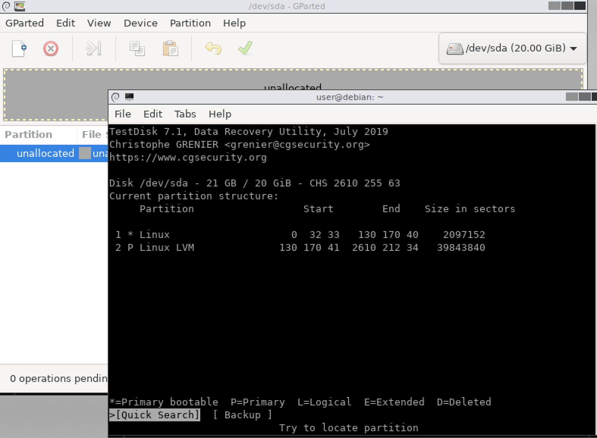
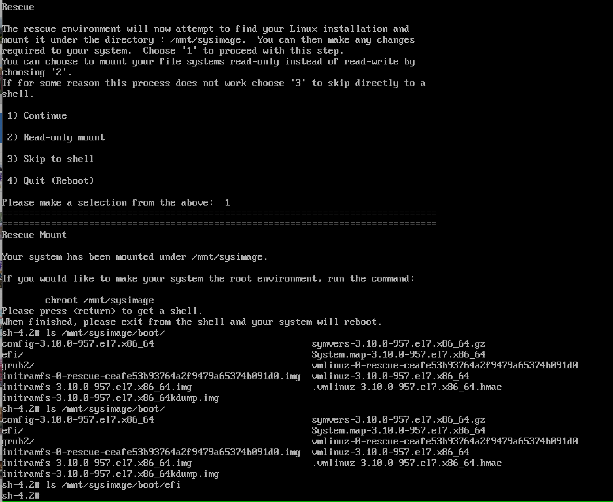
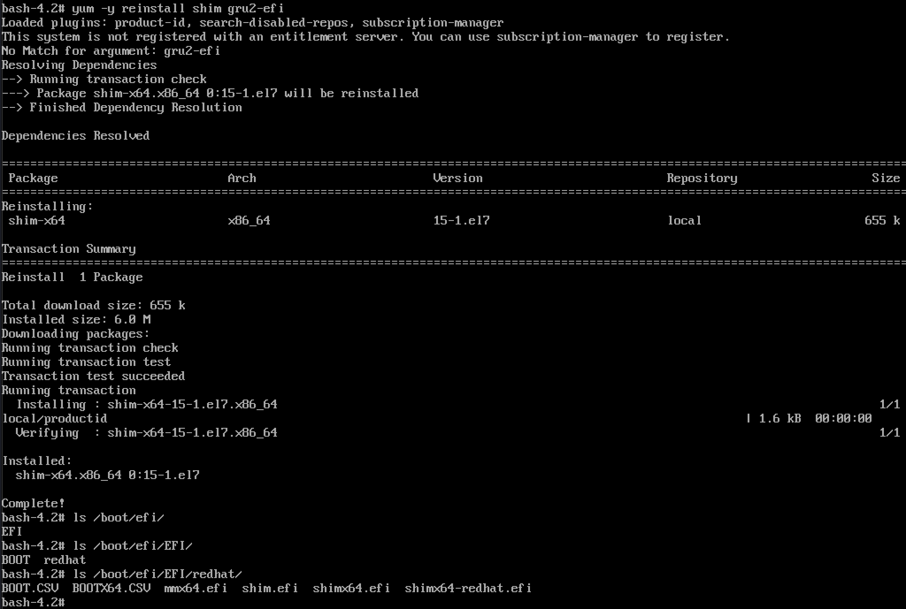
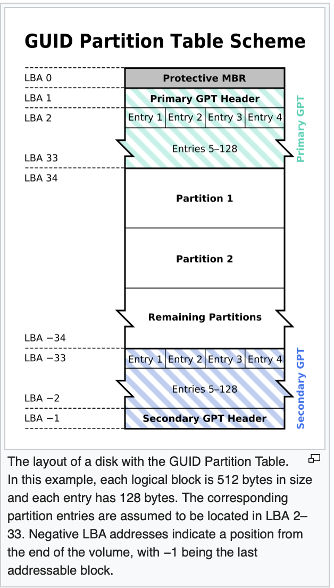
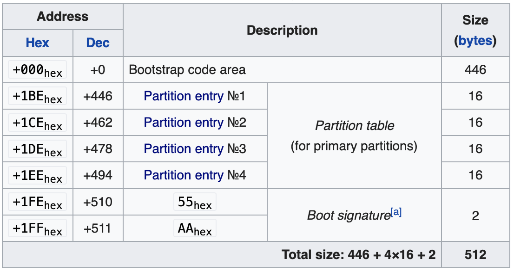
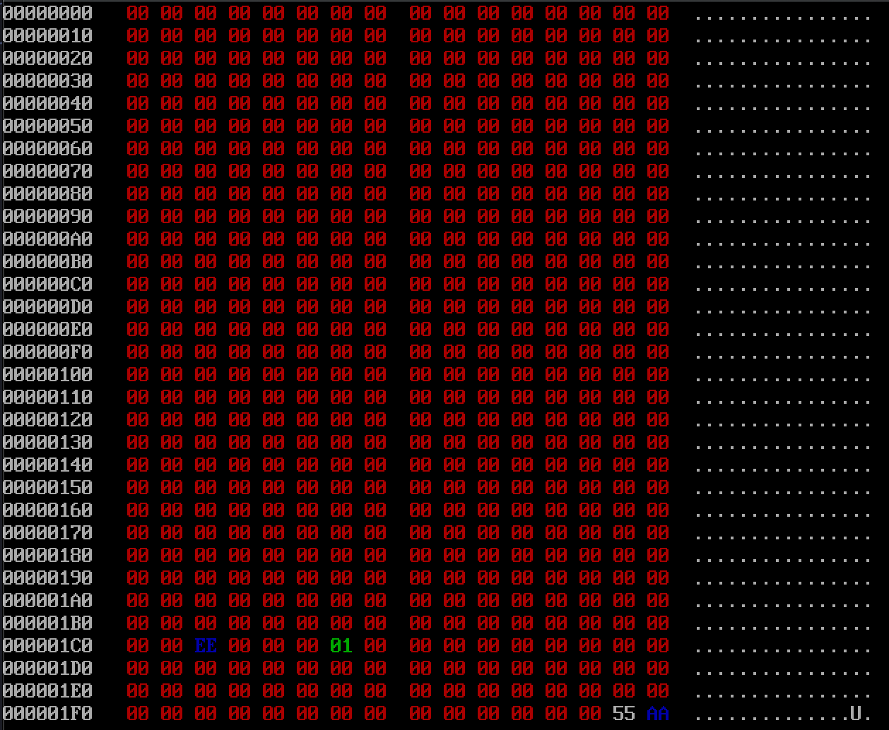
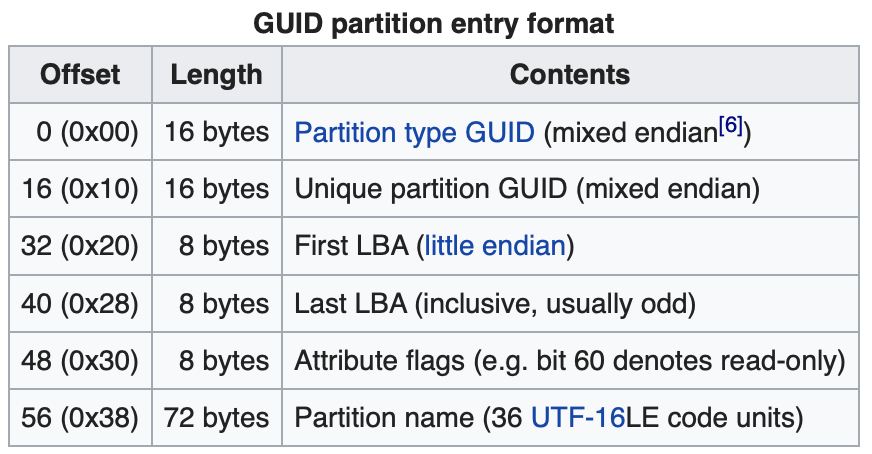

在 Linux 的运维故障中，操作系统无法正常启动算是其中常见的一类，也是影响比较严重的一类。本篇主要介绍导致操作系统不能正常启动的其中两种情况：启动磁盘分区表损坏和 grub 损坏。

这两类情况根据基础环境的不同，又可以分为 **BIOS + MBR** 和 **UEFI + GPT** 。

## 一、BIOS + MBR

在 [**BIOS**](https://zh.wikipedia.org/wiki/BIOS) 的启动类型中，启动磁盘的分区信息中是存储在磁盘头的第一个扇区中，这个扇区通常叫作 [**MBR**](https://en.wikipedia.org/wiki/Master_boot_record)，MBR 中主要存储了该磁盘的分区表和启动引导记录，其中引导记录占用了前面 446 个字节，而磁盘分区则占用紧随的 64 个字节。

所以我们可以通过清除 MBR 前 446 个字节来模拟启动记录损坏的场景，通过清除前 510 个字节来模拟启动记录和磁盘分区都损坏的场景。

### 1. 启动记录损坏

```
dd < /dev/zero >/dev/sda bs=1 count=446
```

启动失败，进入到修复模式如下图：


> 注意，这个时候是可以通过 `chroot /mnt/sysimage` 切换到原来的 root 分区的，因为分区信息还在。

执行以下命令重新修复启动分区：

```
grub2-install /dev/sda
```

重启恢复正常。

### 2. 启动记录和磁盘分区损坏

```
dd < /dev/zero >/dev/sda bs=1 count=510
```

启动失败，进入到修复模式如下图：


> 注意，这个时候已经不能通过 `chroot /mnt/sysimage` 切换到原来的 root 分区，因为分区信息也已经损坏。

首先第一步是要修复启动分区表，可以借助 [**testdisk**](https://www.cgsecurity.org/wiki/TestDisk) 工具。

因为系统已经不能启动，所以只能通过挂载光驱或 usb 的方式将 [**testdisk**](https://www.cgsecurity.org/wiki/TestDisk) 工具挂载到修复模式，本篇中使用 [**gparted**](https://gparted.sourceforge.io/livecd.php) 的 live 镜像，这里面也包含了 testdisk 工具，当然还可以使用 [**ALT Linux**](https://en.altlinux.org/Rescue) 和 [**systemrescuecd**](http://www.system-rescue-cd.org/Download/) 或其他工具。

通过 testdisk 修复分区表很简单，基本就是下一步下一步的傻瓜式操作，如果有问题可以参考 [官方的文档]((https://www.cgsecurity.org/wiki/TestDisk)) 操作。



恢复了分区表后重启，再次进入修复模式，又见到了熟悉的 `chroot` 模式，重复上节操作，即可正常恢复系统。

> 有时执行 chroot 可能报错：
> 
>  `failed to run command '/bin/bash': No such file or directory`
> 
> 这通常是由于在你的 chroot 环境中没有 /bin/bash 程序，或则缺少执行 /bin/bash 的库文件，可以通过 `ldd $( command -v bash )` 查看 bash 依赖哪些库文件，然后将这些文件 `mount -o bind` 到你的 chroot 环境中，或直接 copy 到 chroot 环境中。


> 注意，如果启用了 SElinux，则还要安装 SELinux label，当然不安装，后面重启的时候系统会自动生成，但会根据文件系统的大小花费一定的时间。

### 3. grub 损坏

在之前的另一篇文章 [Linux 启动过程](www.google.com) 中讲到，服务器找到 MBR 的启动记录后，接着会使用 [**grub**](https://www.gnu.org/software/grub/) 来加载内存初始镜像（initramfs*）和内核文件（vmlinuz*），那如果 [**grub**](https://www.gnu.org/software/grub/) 损坏了如何修复呢？

删除 grub 文件，模拟 grub 损坏：

```
rm /boot/grub2/ -rf
```

重启失败，进入 grub 命令行：


退出 grub 命令行，进入修复模式：


执行以下命令恢复 grub：

```
chroot /mnt/sysimage
grub2-install /dev/sda   # 会重新生成 /boot/grub2/ 目录
grub2-mkconfig -o /boot/grub2/grub.cfg
```

> 这里有个疑问，/boot/grub2/grub.cfg 文件是靠软件包 grub2-pc 生成的，但如果删除了 grub.cfg 文件，重新安装这个软件包并不会重新生成 grub.cfg 文件，有了解原因的还望不吝告知，留言或邮件都可以，谢谢。

以上基本模拟了在 BIOS + MBR 基础上的启动记录损坏、启动分区表损坏、grub 损坏的场景并进行了修复，但在 UEFI + GPT 下，过程则不太一样。

## 二、UEFI + GPT

在 [**UEFI**](https://en.wikipedia.org/wiki/Unified_Extensible_Firmware_Interface) + [**GPT**](https://en.wikipedia.org/wiki/GUID_Partition_Table) 的启动过程中，在服务器开机自检 (POST) 完成后，就会加载 [**ESP**](https://en.wikipedia.org/wiki/EFI_system_partition)(EFI System Partition) 的 UEFI 固件，UEFI 固件会初始化启动要用的硬件，并读取其引导管理器以确定从何处（比如，从哪个硬盘及分区）加载哪个 UEFI 应用。所以 UEFI 的启动信息都在 [**ESP**](https://en.wikipedia.org/wiki/EFI_system_partition) 中（通常是 `/boot/efi`）。

下面主要模拟 ESP 损坏和 GPT 损坏的场景。

### 1. ESP 损坏

因为 ESP 本身就是一个系统分区，所以它的损坏又可以分为两种情况：

- ESP 分区里面的文件损坏或丢失
- ESP 分区信息损坏

ESP 分区信息本身就包含在 GPT 分区信息里面，所以第二种情况其实就是属于 GPT 损坏的场景，所以这里只演示 ESP 分区里面的文件损坏或丢失。

删除 EFI 目录，模拟 EFI 文件丢失：

```
[root@base ~]# ls /boot/efi
EFI
[root@base ~]# rm /boot/efi -rf
rm: 无法删除 "/boot/efi": 设备或资源忙
[root@base ~]# ls /boot/efi
```

重启系统，无法正常启动。

进入修复模式，因为分区信息还在，所以可以 chroot 到原来的根文件系统，但 `/boot/efi` 目录下没有 EFI、grub 等文件。



所以只要恢复 ESP 文件系统下的那些 `.efi` 文件就可以修复。

首先切换到原来的系统环境：

```
chroot /mnt/sysimage
```

挂载光驱，重新安装 `grub2-efi` 和 `shim` 软件包。



然后再重新生成 `grub.cfg` 配置文件，不然会进入到 grub 命令行接口界面。

```
grub2-mkconfig -o /boot/efi/EFI/redhat/grub.cfg
```

> 作用类似于 BIOS + MBR 下的 grub2-install 命令

重启系统，即可正常启动。


### 2. GPT 损坏

[**GPT**](https://en.wikipedia.org/wiki/GUID_Partition_Table) 分区表类型中，是以 [**LBA**](https://en.wikipedia.org/wiki/Logical_block_addressing)(Logical Block Address，逻辑块寻址) 来定义扇区的位置，比如 LBA0 LBA1 等。

本篇结合 gpt 结构图来分别说明：
- LBA0 的损坏
- LBA1 的损坏
- LBA2 ~ LBA33 的损坏



#### 1. LBA0

LBA0 是一个保护性 MBR，是出于兼容性而存储了一份传统的 [MBR](https://en.wikipedia.org/wiki/Master_boot_record#PTE)。


至于每个 LBA 对应的物理空间是多少，可以通过 `parted` 或 `blockdev` 命令查看：

```
root@base ~]# parted
GNU Parted 3.1
使用 /dev/sda
Welcome to GNU Parted! Type 'help' to view a list of commands.
(parted) print
Model: VMware, VMware Virtual S (scsi)
Disk /dev/sda: 10.7GB
Sector size (logical/physical): 512B/512B
Partition Table: gpt
Disk Flags:

Number  Start   End     Size    File system  Name                  标志
 1      1049kB  211MB   210MB   fat16        EFI System Partition  启动
 2      211MB   1285MB  1074MB  xfs
 3      1285MB  7729MB  6445MB                                     lvm

```

或
```
blockdev --getss  /dev/sda
```

从以上信息中可以看出：
- 分区表类型为 gpt(使用 fdisk 命令也可查看分区表类型)
- 逻辑 / 物理扇区大小 512B
- 启动类型 EFI


我们先看看 sda 的 LBA0(扇区 1，也就是 MBR) 存储的内容：

```
[root@base ~]# xxd -g1 -l 512 /dev/sda
0000000: 00 00 00 00 00 00 00 00 00 00 00 00 00 00 00 00  ................
0000010: 00 00 00 00 00 00 00 00 00 00 00 00 00 00 00 00  ................
0000020: 00 00 00 00 00 00 00 00 00 00 00 00 00 00 00 00  ................
0000030: 00 00 00 00 00 00 00 00 00 00 00 00 00 00 00 00  ................
0000040: 00 00 00 00 00 00 00 00 00 00 00 00 00 00 00 00  ................
0000050: 00 00 00 00 00 00 00 00 00 00 00 00 00 00 00 00  ................
0000060: 00 00 00 00 00 00 00 00 00 00 00 00 00 00 00 00  ................
0000070: 00 00 00 00 00 00 00 00 00 00 00 00 00 00 00 00  ................
0000080: 00 00 00 00 00 00 00 00 00 00 00 00 00 00 00 00  ................
0000090: 00 00 00 00 00 00 00 00 00 00 00 00 00 00 00 00  ................
00000a0: 00 00 00 00 00 00 00 00 00 00 00 00 00 00 00 00  ................
00000b0: 00 00 00 00 00 00 00 00 00 00 00 00 00 00 00 00  ................
00000c0: 00 00 00 00 00 00 00 00 00 00 00 00 00 00 00 00  ................
00000d0: 00 00 00 00 00 00 00 00 00 00 00 00 00 00 00 00  ................
00000e0: 00 00 00 00 00 00 00 00 00 00 00 00 00 00 00 00  ................
00000f0: 00 00 00 00 00 00 00 00 00 00 00 00 00 00 00 00  ................
0000100: 00 00 00 00 00 00 00 00 00 00 00 00 00 00 00 00  ................
0000110: 00 00 00 00 00 00 00 00 00 00 00 00 00 00 00 00  ................
0000120: 00 00 00 00 00 00 00 00 00 00 00 00 00 00 00 00  ................
0000130: 00 00 00 00 00 00 00 00 00 00 00 00 00 00 00 00  ................
0000140: 00 00 00 00 00 00 00 00 00 00 00 00 00 00 00 00  ................
0000150: 00 00 00 00 00 00 00 00 00 00 00 00 00 00 00 00  ................
0000160: 00 00 00 00 00 00 00 00 00 00 00 00 00 00 00 00  ................
0000170: 00 00 00 00 00 00 00 00 00 00 00 00 00 00 00 00  ................
0000180: 00 00 00 00 00 00 00 00 00 00 00 00 00 00 00 00  ................
0000190: 00 00 00 00 00 00 00 00 00 00 00 00 00 00 00 00  ................
00001a0: 00 00 00 00 00 00 00 00 00 00 00 00 00 00 00 00  ................
00001b0: 00 00 00 00 00 00 00 00 00 00 00 00 00 00 00 00  ................
00001c0: 01 00 ee fe ff ff 01 00 00 00 ff ff 3f 01 00 00  ............?...
00001d0: 00 00 00 00 00 00 00 00 00 00 00 00 00 00 00 00  ................
00001e0: 00 00 00 00 00 00 00 00 00 00 00 00 00 00 00 00  ................
00001f0: 00 00 00 00 00 00 00 00 00 00 00 00 00 00 55 aa  ..............U.
```
> 查看 16 进制的工具很多，在 Windows 上大多数是用 `winhex`，Linux 可以用 `wxHexEditor`、`010 Editor`、`MadEdit` 、`Xxd`、`Hexedit`、`Hexyl`、`Ghex`、`Bless`、`Okteta` 等等。

对照 [**MBR**](https://en.wikipedia.org/wiki/Master_boot_record) 结构图：



可以看到，[**MBR**](https://en.wikipedia.org/wiki/Master_boot_record) 中的 BootCode 全为 0（前 446 字节），分区表中也只有分区表 1 有数据：

```
00 00 01 00 ee fe ff ff 01 00 00 00 ff ff 3f 01
```

再对比 MBR 的[分区表条目结构图](https://en.wikipedia.org/wiki/Master_boot_record#Sector_layout)：


拆解分区表 1 的内容：
```
00 00 01 00 ee fe ff ff 01 00 00 00 ff ff 3f 01
```

其中：

值 | 解释
-|-
0x00 | 代表此分区激活状态(80 才是代表激活)
0x00 | 起始 Cylinder
0x01 | 起始 Head
0x00 | 起始 Sector
0xee | 分区类型
0xfe | 结束 Cylinder
0xff | 结束 Head
0xff | 结束 Sector
0x01000000 | 起始扇区的 LBA
0xffff3f01 | 此分区的扇区数

> 由于 inter CPU 采用的是 [little endian](https://baike.baidu.com/item/Little-Endian/4118225?fr=aladdin)，所以在小于 2T 的磁盘上，分区总的字节数应该是 Hex 的 013fffff = Decimal 20971519 * 512，在大于 2T 的磁盘上，这个数始终算出来是 2T。 

`0xee` 的分区类型的作用是告诉其他 MBR 磁盘工具，这个磁盘是使用的 GPT 分区表，不会让它们识别为这是一块未分区的磁盘，并拒绝它们对磁盘进行操作，从而避免因为意外而删除分区的风险。

现在通过几种不同的方式来模拟 LAB 0 中 MBR 分区表信息损坏的场景，看看会发生什么：

- 1）dd < /dev/zero >/dev/sda bs=1 count=446
- 2）dd < /dev/zero >/dev/sda bs=1 count=450
- 3）dd < /dev/zero >/dev/sda bs=1 count=451

限于篇幅原因，这里只给出实验结果：

- 1）的情况下，系统能正常重启
- 2）的情况下，系统能正常重启
- 3）的情况下，系统不能正常重启，但系统可以认到一个空的分区表

```
[root@base ~]# xxd -g1 -l 1 -s 450 /dev/sda  # 取出第 450 个字节
00001c2: ee                                               .
[root@base ~]# dd < /dev/zero >/dev/sda bs=1 count=451 # 清除前 451 个 字节
记录了 451+0 的读入
记录了 451+0 的写出
451 字节 (451 B) 已复制，0.00159757 秒，282 kB / 秒
[root@base ~]# xxd -g1 -l 1 -s 450 /dev/sda
00001c2: 00                                               .
[root@base ~]#
```


**其实这也间接证明了第 451 个 字节，分区表类型 `0xee` 的作用，一旦清除了这个字节，系统就不能识别到这个磁盘是使用的 GPT 分区表，从而找不到有效分区（此时系统还能认到一个分区，因为 LBA0 里面本身就包含了一个分区表条目），也就无法正常启动，但清除前面的 450 个字节是不会影响磁盘的。**

那这种情况下如何修复？

还是进入修复模式，因为系统误识别这个是 MBR 分区表，但又读不到 bootcode 和有效的分区表，所以还是无法使用 `chroot` 命令进入原来的根目录环境。我们可以在修复模式下使用十六进制编辑工具 `hexedit`（当然也可以使用 `xdd`、`hexyl`、`ghex`、`okteta`、`wxhexeditor`、`hexcurse`、`hexer` 等工具）手工编辑相应的字节，使系统识别到这个磁盘是 GPT 格式的分区表：

```
hexedit -s --color /dev/sda
```

然后将第 451 个字节修改为 `ee` 即可。

> 如果是清空了 LBA0 的全部 512 个字节，则还需修改 LBA 的起始信息，也就是将第 455、456、457 字节修改为 `010000`，其余信息则无所谓。



重启系统，可以正常启动。


#### 2. LBA1

还是看上面的 GPT 分区结构图，LBA1 是 [GPT 头](https://en.wikipedia.org/wiki/GUID_Partition_Table#Partition_table_header_(LBA_1))，其格式如下：


读取 LBA1 的 512 个字节：
```
[root@base ~]# xxd -g1 -l 512 -s 512 /dev/sda
0000200: 45 46 49 20 50 41 52 54 00 00 01 00 5c 00 00 00  EFI PART....\...
0000210: fc 3c 8a 77 00 00 00 00 01 00 00 00 00 00 00 00  .<.w............
0000220: ff ff 3f 01 00 00 00 00 22 00 00 00 00 00 00 00  ..?.....".......
0000230: de ff 3f 01 00 00 00 00 73 31 0f 65 2e 01 a5 49  ..?.....s1.e...I
0000240: a2 02 70 48 3b d6 95 05 02 00 00 00 00 00 00 00  ..pH;...........
0000250: 80 00 00 00 80 00 00 00 52 b2 04 ae 00 00 00 00  ........R.......
0000260: 00 00 00 00 00 00 00 00 00 00 00 00 00 00 00 00  ................
0000270: 00 00 00 00 00 00 00 00 00 00 00 00 00 00 00 00  ................
0000280: 00 00 00 00 00 00 00 00 00 00 00 00 00 00 00 00  ................
0000290: 00 00 00 00 00 00 00 00 00 00 00 00 00 00 00 00  ................
00002a0: 00 00 00 00 00 00 00 00 00 00 00 00 00 00 00 00  ................
00002b0: 00 00 00 00 00 00 00 00 00 00 00 00 00 00 00 00  ................
00002c0: 00 00 00 00 00 00 00 00 00 00 00 00 00 00 00 00  ................
00002d0: 00 00 00 00 00 00 00 00 00 00 00 00 00 00 00 00  ................
00002e0: 00 00 00 00 00 00 00 00 00 00 00 00 00 00 00 00  ................
00002f0: 00 00 00 00 00 00 00 00 00 00 00 00 00 00 00 00  ................
0000300: 00 00 00 00 00 00 00 00 00 00 00 00 00 00 00 00  ................
0000310: 00 00 00 00 00 00 00 00 00 00 00 00 00 00 00 00  ................
0000320: 00 00 00 00 00 00 00 00 00 00 00 00 00 00 00 00  ................
0000330: 00 00 00 00 00 00 00 00 00 00 00 00 00 00 00 00  ................
0000340: 00 00 00 00 00 00 00 00 00 00 00 00 00 00 00 00  ................
0000350: 00 00 00 00 00 00 00 00 00 00 00 00 00 00 00 00  ................
0000360: 00 00 00 00 00 00 00 00 00 00 00 00 00 00 00 00  ................
0000370: 00 00 00 00 00 00 00 00 00 00 00 00 00 00 00 00  ................
0000380: 00 00 00 00 00 00 00 00 00 00 00 00 00 00 00 00  ................
0000390: 00 00 00 00 00 00 00 00 00 00 00 00 00 00 00 00  ................
00003a0: 00 00 00 00 00 00 00 00 00 00 00 00 00 00 00 00  ................
00003b0: 00 00 00 00 00 00 00 00 00 00 00 00 00 00 00 00  ................
00003c0: 00 00 00 00 00 00 00 00 00 00 00 00 00 00 00 00  ................
00003d0: 00 00 00 00 00 00 00 00 00 00 00 00 00 00 00 00  ................
00003e0: 00 00 00 00 00 00 00 00 00 00 00 00 00 00 00 00  ................
00003f0: 00 00 00 00 00 00 00 00 00 00 00 00 00 00 00 00  ................
```

对应拆解 GPT 头结构：

相对字节偏移量(十六进制)| 字节数 | 值 | 说明(整数皆以 little endian 方式表示)
-|-|-|-
00～07 | 8 | 45 46 49 20 50 41 52 54| GPT 头签名，(ASCII 码为 "EFI PART")
08～0B | 4 | 00 00 01 00 | 版本号，目前是 1.0 版
0C～0F | 4 | 5c 00 00 00| GPT 头的大小(字节数)，也就是 92 字节。
10～13 | 4 | fc 3c 8a 77| GPT 头 CRC 校验和(计算时把这个字段本身看做零值)
14～17 | 4 | 00 00 00 00 | 保留，必须为 0
18～1F | 8 | 01 00 00 00 00 00 00 00| EFI 信息区 (GPT 头) 的起始扇区号，也就是 LBA1。
20～27 | 8 | ff ff 3f 01 00 00 00 00| EFI 信息区 (GPT 头) 备份位置的扇区号，也就是 EFI 区域结束扇区号。通常是整个磁盘最末一个扇区。
28～2F | 8 | 22 00 00 00 00 00 00 00| GPT 分区区域的起始扇区号，也即是 LBA34。
30～37 | 8 | de ff 3f 01 00 00 00 00| GPT 分区区域的结束扇区号，通常是倒数第 34 扇区。
38～47 | 16 | 73 31 0f 65 2e 01 a5 49 a2 02 70 48 3b d6 95 05 | 磁盘 GUID(全球唯一标识符，与 UUID 是同义词)
48～4F | 8 | 02 00 00 00 00 00 00 00 | 分区表起始扇区号，也就是 LBA2。
50～53 | 4 | 80 00 00 00 | 分区表总项数，通常限定为，也就是 128 个。
54～57 | 4 | 80 00 00 00 | 每个分区表项占用字节数，也就是 128 字节。
58～5B | 4 | 52 b2 04 ae | 分区表 CRC 校验和
5C～*|*|| 保留，通常是全零填充

可以看出 GPT 头中主要包含了磁盘的一些定义内容，如果清除掉 LBA1，系统能不能启动呢？

```
dd < /dev/zero >/dev/sda seek=512 bs=1 count=512
```

实验结果是，系统完全可以正常启动，而且又会恢复成初始的值。探其原因，其实可以在上面的 GPT 分区结构图中发现，原来 GPT 头信息还在最后一个扇区中备份了一份，所以即使清空掉 LBA1，系统也不受影响，但如果把最后一个 LBA 也清空掉，那系统就无法启动了（其实只要清空前 8 个字节，系统都无法启动）。

先看看最后一个 LBA 的内容：
```
[root@base ~]# xxd -g1 -l 512 -s $((`blockdev --getsz /dev/sda` * 512 - 512)) /dev/sda
27ffffe0045 46 49 20 50 41 52 54 00 00 01 00 5c 00 00 00  EFI PART....\...
27ffffe1051 ef 04 c8 00 00 00 00 ff ff 3f 01 00 00 00 00  Q.........?.....
27ffffe2001 00 00 00 00 00 00 00 22 00 00 00 00 00 00 00  ........".......
27ffffe30de ff 3f 01 00 00 00 00 73 31 0f 65 2e 01 a5 49  ..?.....s1.e...I
27ffffe40a2 02 70 48 3b d6 95 05 df ff 3f 01 00 00 00 00  ..pH;.....?.....
27ffffe5080 00 00 00 80 00 00 00 52 b2 04 ae 00 00 00 00  ........R.......
27ffffe6000 00 00 00 00 00 00 00 00 00 00 00 00 00 00 00  ................
27ffffe7000 00 00 00 00 00 00 00 00 00 00 00 00 00 00 00  ................
27ffffe8000 00 00 00 00 00 00 00 00 00 00 00 00 00 00 00  ................
27ffffe9000 00 00 00 00 00 00 00 00 00 00 00 00 00 00 00  ................
27ffffea000 00 00 00 00 00 00 00 00 00 00 00 00 00 00 00  ................
27ffffeb000 00 00 00 00 00 00 00 00 00 00 00 00 00 00 00  ................
27ffffec000 00 00 00 00 00 00 00 00 00 00 00 00 00 00 00  ................
27ffffed000 00 00 00 00 00 00 00 00 00 00 00 00 00 00 00  ................
27ffffee000 00 00 00 00 00 00 00 00 00 00 00 00 00 00 00  ................
27ffffef000 00 00 00 00 00 00 00 00 00 00 00 00 00 00 00  ................
27fffff0000 00 00 00 00 00 00 00 00 00 00 00 00 00 00 00  ................
27fffff1000 00 00 00 00 00 00 00 00 00 00 00 00 00 00 00  ................
27fffff2000 00 00 00 00 00 00 00 00 00 00 00 00 00 00 00  ................
27fffff3000 00 00 00 00 00 00 00 00 00 00 00 00 00 00 00  ................
27fffff4000 00 00 00 00 00 00 00 00 00 00 00 00 00 00 00  ................
27fffff5000 00 00 00 00 00 00 00 00 00 00 00 00 00 00 00  ................
27fffff6000 00 00 00 00 00 00 00 00 00 00 00 00 00 00 00  ................
27fffff7000 00 00 00 00 00 00 00 00 00 00 00 00 00 00 00  ................
27fffff8000 00 00 00 00 00 00 00 00 00 00 00 00 00 00 00  ................
27fffff9000 00 00 00 00 00 00 00 00 00 00 00 00 00 00 00  ................
27fffffa000 00 00 00 00 00 00 00 00 00 00 00 00 00 00 00  ................
27fffffb000 00 00 00 00 00 00 00 00 00 00 00 00 00 00 00  ................
27fffffc000 00 00 00 00 00 00 00 00 00 00 00 00 00 00 00  ................
27fffffd000 00 00 00 00 00 00 00 00 00 00 00 00 00 00 00  ................
27fffffe000 00 00 00 00 00 00 00 00 00 00 00 00 00 00 00  ................
27ffffff000 00 00 00 00 00 00 00 00 00 00 00 00 00 00 00  ................
```

对比 LBA0，两者一模一样。

清除 LAB0 的前 8 个字节和最后一个 LBA：
```
dd < /dev/zero >/dev/sda seek=512 bs=1 count=8
dd < /dev/zero >/dev/sda count=512 bs=1 seek=$((`blockdev --getsz /dev/sda` * 512 - 512))
```

重启系统，无法启动。

> 操作前一定要备份。

#### 3. LBA2 ~ LBA33

接着再来看看分区表，还是根据 GPT 分区结构图，分区表一般是占用了 LBA2 - LBA33，这 32 个 LBA 里面包含了所有的分区表信息，但 GPT 的规范定义里面并没有定义一个分区条目占用多少个 LBA，所有不太方便单独找出某个分区的信息，这里以我实验环境为例，来看看 LBA2 - LBA33 里面到底包含了哪些信息。

由于后面都是 0，所以我只截取了前面 288 个字节：
```
[root@base ~]# xxd -g1 -l 288 -s 1024 /dev/sda
0000400: 28 73 2a c1 1f f8 d2 11 ba 4b 00 a0 c9 3e c9 3b  (s*......K...>.;
0000410: cf ba f1 85 2a 4e 81 4b a1 0d b4 4e 4f 41 b9 e8  ....*N.K...NOA..
0000420: 00 08 00 00 00 00 00 00 ff 47 06 00 00 00 00 00  .........G......
0000430: 00 00 00 00 00 00 00 00 45 00 46 00 49 00 20 00  ........E.F.I. .
0000440: 53 00 79 00 73 00 74 00 65 00 6d 00 20 00 50 00  S.y.s.t.e.m. .P.
0000450: 61 00 72 00 74 00 69 00 74 00 69 00 6f 00 6e 00  a.r.t.i.t.i.o.n.
0000460: 00 00 00 00 00 00 00 00 00 00 00 00 00 00 00 00  ................
0000470: 00 00 00 00 00 00 00 00 00 00 00 00 00 00 00 00  ................
0000480: a2 a0 d0 eb e5 b9 33 44 87 c0 68 b6 b7 26 99 c7  ......3D..h..&..
0000490: 53 4e 33 58 50 0c c6 47 8f 9f 3c ef 90 45 17 27  SN3XP..G..<..E.'
00004a0: 00 48 06 00 00 00 00 00 ff 47 26 00 00 00 00 00  .H.......G&.....
00004b0: 00 00 00 00 00 00 00 00 00 00 00 00 00 00 00 00  ................
00004c0: 00 00 00 00 00 00 00 00 00 00 00 00 00 00 00 00  ................
00004d0: 00 00 00 00 00 00 00 00 00 00 00 00 00 00 00 00  ................
00004e0: 00 00 00 00 00 00 00 00 00 00 00 00 00 00 00 00  ................
00004f0: 00 00 00 00 00 00 00 00 00 00 00 00 00 00 00 00  ................
0000500: 79 d3 d6 e6 07 f5 c2 44 a2 3c 23 8f 2a 3d f9 28  y......D.<#.*=.(
0000510: 20 06 80 7a e0 15 72 4a 92 26 eb f0 48 3f 30 b9   ..z..rJ.&..H?0.
```

参考维基 [GPT 分区表条目](https://en.wikipedia.org/wiki/GUID_Partition_Table#Partition_entries_(LBA_2–33))：



再结合系统上的分区信息：

```
[root@base ~]# blkid -o export -p /dev/sda[1-3]
DEVNAME=/dev/sda1
SEC_TYPE=msdos
UUID=A985-FEAE
VERSION=FAT16
TYPE=vfat
USAGE=filesystem
PART_ENTRY_SCHEME=gpt
PART_ENTRY_NAME=EFI System Partition
PART_ENTRY_UUID=85f1bacf-4e2a-4b81-a10d-b44e4f41b9e8
PART_ENTRY_TYPE=c12a7328-f81f-11d2-ba4b-00a0c93ec93b
PART_ENTRY_NUMBER=1
PART_ENTRY_OFFSET=2048
PART_ENTRY_SIZE=409600
PART_ENTRY_DISK=8:0

DEVNAME=/dev/sda2
UUID=a13803e2-b4bb-4039-8d72-afbc21ecae55
TYPE=xfs
USAGE=filesystem
PART_ENTRY_SCHEME=gpt
PART_ENTRY_UUID=58334e53-0c50-47c6-8f9f-3cef90451727
PART_ENTRY_TYPE=ebd0a0a2-b9e5-4433-87c0-68b6b72699c7
PART_ENTRY_NUMBER=2
PART_ENTRY_OFFSET=411648
PART_ENTRY_SIZE=2097152
PART_ENTRY_DISK=8:0

DEVNAME=/dev/sda3
UUID=9SqofC-60Gm-ibCH-XJ3f-m2FR-ESRy-zeHAuA
VERSION=LVM2 001
TYPE=LVM2_member
USAGE=raid
PART_ENTRY_SCHEME=gpt
PART_ENTRY_UUID=7a800620-15e0-4a72-9226-ebf0483f30b9
PART_ENTRY_TYPE=e6d6d379-f507-44c2-a23c-238f2a3df928
PART_ENTRY_NUMBER=3
PART_ENTRY_OFFSET=2508800
PART_ENTRY_SIZE=12587008
PART_ENTRY_DISK=8:0
```

对比两个结果，可以找到的信息包括：

值 | 解释
-|-
C12A7328-F81F-11D2-BA4B-00A0C93EC93B | 用 GUID 表示的分区类型：EFI System partition
EBD0A0A2-B9E5-4433-87C0-68B6B72699C7 | 用 GUID 表示的分区类型：Windows Basic data partition([参考这里](https://en.wikipedia.org/wiki/GUID_Partition_Table#cite_note-linwin-41)了解为什么是 Windows)
e6d6d379-f507-44c2-a23c-238f2a3df928 | 用 GUID 表示的分区类型：Linux Logical Volume Manager (LVM) partition
85f1bacf-4e2a-4b81-a10d-b44e4f41b9e8 | 分区 GUID
58334e53-0c50-47c6-8f9f-3cef90451727 | 分区 GUID
7a800620-15e0-4a72-9226-ebf0483f30b9 | 分区 GUID
2048 / 409600 | 分区 1 起始 / 结束扇区号（LBA）：80 / 647ff
411648 / 2097152 | 分区 2 起始 / 结束扇区号（LBA）：64800 / 2647ff

> 计算方法：起始 LBA = ./conhex.sh -d2x `echo $(( 411648 ))`，结束 LBA = ./conhex.sh -d2x `echo $(( 411648+2097152-1 ))`

到这里就基本说完了整个分区上的内容，因为 LBA-1 ~ LBA-33 的内容是 LBA1 ~ LBA33 的备份，剩下 LBA34 ~ LBA-34 是真正分配个分区存储数据的位置。


#### 4. 总结

了解了 GPT 分区的结构后，总结的修复方法：

故障 | 修复
-|-
LBA0 损坏 | 手动修改 LAB0 的第 451、455、456、457 字节
LBA1 损坏 | 从 LBA1 备份恢复
LBA2 ~ LBA33 损坏 | 从 LBA2 ~ LBA33 备份恢复
所有 LBA 备份同时损坏 | 根据日常的备份信息，手工去修改对应 LBA 中的字节

实在不知道怎么去手动修复，试试用其他工具来自动恢复，比如 `gpart`、`gdisk`、`sgdisk` 等。


## 附录

> 1. 十六进制和十进制互相转换的 shell 脚本 conhex.sh


```shell
#!/bin/bash

# validate sufficient input
test -n "$1" && test -n "$2" || {
    printf "\n error: insufficient input \n usage: %s -d2x DecimalNum\n        %s -x2d HexDecimalNum\n" "${0//*\//}" "${0//*\//}"

    exit 1
}

# Convert hexadecimal to decimal

# with bash:
# $ echo $((16#FF))

# with bc:
# $ echo "ibase=16; FF" | bc

# with perl:
# $ perl -le 'print hex("FF");'

# with printf :
# $ printf "%d\n" 0xFF

# with python:
# $ python -c 'print(int("FF", 16))'
xd() {
    printf "16->10 $(( 0x${1} ))\n\n"
}

# Convert decimal to hexadecimal
dx() {
    printf "10->16 %x\n\n" ${1}
}

# Convert string to ASCII
# printf "%d\n" "'A"

case "${1}" in
    -d2x)
        dx $2
        ;;
    -x2d)
        xd $2
        ;;
    -h)
        printf "usage: %s -d2x DecimalNum\n               -x2d HexDecimalNum\n" "${0//*\//}"
        ;;
    *)
        echo "Invalid Paramter: ${1}, must be -d2x or -x2d"
        exit;
esac
```

> 2. 不重启识别新分区


```
partx -av /dev/vda
```

> 3. [利用 python 获取磁盘分区的起始扇区的 LBA 以及磁盘分区大小](https://www.lulinux.com/jiaocheng/190.html)


> 4. GPT 和 MBR 下的备份

###### MBR 备份和恢复
```shell
# 备份 MBR
dd if=/dev/sda of=/backup/mbr.backup  bs=1  count=512
# 恢复 MBR
dd if=/backup/mbr.backup  of=/dev/sda
```
###### 分区表备份和恢复
```shell
# 备份分区表
dd if=/dev/sda of=/backup/partition_table.bak bs=1 count=64 skip=446
# 恢复分区表
dd if=/backup/partition_table.bak of=/dev/sda bs=1 seek=446
```

###### GPT 备份和恢复
```shell
# 备份 Protective MBR
dd if=/dev/sda of=gpt-mbr bs=512 count=1
# 恢复 Protective MBR
dd if=gpt-mbr of=/dev/sda bs=512 count=1

# 备份完整的 GPT 分区表
dd if=/dev/sda of=gpt-partition bs=512 count=34
# 恢复完整的 GPT 分区表
dd if=gpt--partition of=/dev/sda bs=512 count=34

# 仅备份 GPT 头和 GPT 分区
dd if=/dev/sda of=gpt-partition bs=512 skip=1 count=33
# 恢复单独的 GPT 分区信息
dd if=gpt-partition of=/dev/sda bs=512 skip=1 seek=1 count=33
```